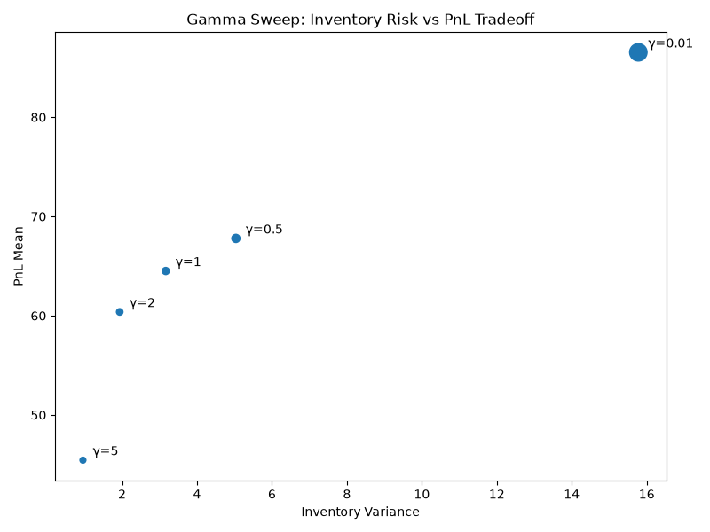
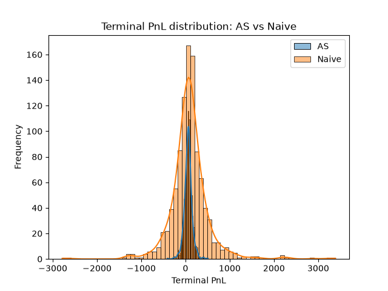
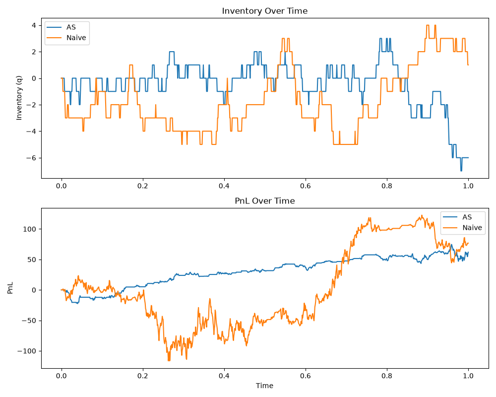

# avellaneda_stoikov_mm
A Monte Carlo simulation comparing an Avellaneda-Stoikov (AS) inventory-aware
market making strategy against a naive fixed-spread baseline, on a simulated
geometric Brownian motion (GBM) price path with Poisson order-arrival dynamics.

The AS strategy skews its quotes based on current inventory to actively manage
risk; the naive strategy quotes a constant spread around the mid-price
regardless of position. This project runs both strategies across a thousand
simulated price paths and measures the resulting trade-off between
profitability and inventory risk.

## Background
Market makers profit from the bid-ask spread, but every filled order changes
their inventory, exposing them to the risk that the price moves against the
position they're now holding. A market maker who only ever quotes a symmetric
spread around the mid-price does nothing to manage this.

Avellaneda and Stoikov's 2008 paper, *"High-frequency trading in a limit order
book"*, solves this with a closed-form optimal quoting strategy derived from a
stochastic control problem: a market maker with an exponential (CARA) utility,
facing a mid-price that follows Brownian motion and order arrivals that hit the
book with λ(δ) = A·e^(−kδ) at a distance δ from the mid.

The solution has two pieces:

- **Reservation price** - an inventory-adjusted "fair" price the market market
quotes around, shifting below the mid-price when long and above it when short:

```
r(s, q, t) = s - q·γ·σ²·(T − t)
```

- **Optimal spread** - the total width quoted around the reservation price,
widening with volatility, time remaining, and risk aversion, and narrowing as
the order-flow intensity parameter k increases:

```
δ_a + δ_b = γ·σ²·(T − t) + (2/γ)·ln(1 + γ/k)
```

Here `γ` is the risk-aversion parameter: `γ → 0` collapses the strategy to the
naive symmetric quoter, while larger `γ` skews quotes more aggressively to push
inventory back toward zero, at the cost of some expected profit.

## What this project does

- Simulates a mid-price path via geometric Brownian motion and Poisson order
arrivals with exponential fill-intensity decay.
- Implements the AS reservation price, optimal spread, and quoting logic, and a
naive fixed-spread baseline sharing the same `quote_fn` interface.
- Runs single-path simulations and full Monte Carlo batches (1,000 paths) for
both strategies, using matched random seeds so any difference in outcome is
attributable to the quoting logic.
- Sweeps the risk-aversion parameter γ to trace out the inventory-risk vs. PnL
trade-off the AS paper predicts.
- Reports Sharpe ratios, terminal-PnL and inventory distributions, and
visualises all of the above.

## Results

Config used below: `s0=100, mu=0.15, sigma=0.5, T=1.0, n_steps=1000, A=150.0,
k=1.5`, AS strategy at `γ=2`, naive strategy spread-matched to the AS strategy's
average width, 1000 Monte Carlo paths per strategy.

### AS vs. naive: profit and risk

| | AS (γ=2) | Naive |
|---|---|---|
| Median terminal PnL | 61.9 | 77.6 |
| Terminal PnL std. dev. | 89.1 | 446.5 |
| Sharpe ratio | **0.68** | 0.20 |
| Mean inventory variance (per path) | 1.94 | 16.86 |
| Terminal inventory std. dev. | 3.52 | 10.13 |

This matches the pattern in the original paper: the naive quoter earns a
*higher* average profit, because it quotes tighter and gets filled more often
with no regard for the risk it's accumulating. The AS strategy trades some of
that mean profit away in exchange for a reduction in inventory variance and PnL
variance. The net effect on risk-adjusted return (Sharpe ratio) favours the AS
strategy over the naive strategy.



The naive strategy's PnL distribution is visibly wider and long-tailed; the AS
distribution is tighter around its mean, which is the direct consequence of
actively managing inventory rather than letting it drift.

### A representative single run



Picking the run closest to each strategy's median outcome makes the mechanism
visible directly: the AS strategy's inventory mean-reverts toward zero
throughout the session, while the naive strategy's inventory drifts and
accumulates in one direction for extended stretches. The AS PnL path is
correspondingly smoother, while the naive path swings by hundreds of dollars as
its unmanaged inventory rides the price.

### The γ sweep: risk aversion trades off against expected profit



Sweeping γ from 0.01 (near risk-neutral) to 5 (highly risk-averse) traces out
the trade-off directly, higher γ monotonically reduces both inventory variance
and mean PnL.

## Limitations
This project simulates the AS model faithfully, but the model carries some
simplifications.

- **End-of-horizon inventory risk.** Both the reservation-price skew and the
risk-widening term of the spread are scaled by `(T - t)`:

  ```
  r(s, q, t) = s − q·γ·σ²·(T − t)
  δ_a + δ_b  = γ·σ²·(T − t) + (2/γ)·ln(1 + γ/k)
  ```

  As `t → T`, both terms vanish - the reservation price collapses back to the raw
  mid-price regardless of inventory, and the spread narrows to just its fixed
  liquidity term. The strategy effectively stops managing inventory risk right as
  the horizon closes, since the model's utility function assigns no cost to
  holding inventory at the exact instant `t = T`. In practice, this can produce a
  sharp, uncorrected inventory swing in the final steps of a run, visible in the
  representative-run plots above. Guéant, Lehalle & Fernandez-Tapia (2013) address
  this issue with an explicit terminal inventory penalty or hard liquidation
  constraint forcing `q → 0` as `t → T`.

- **Simulated order flow.** Fills are generated from a Poisson process with
intensity `λ(δ) = A·e^(−kδ)`, as in the original paper, rather than from actual
order-book depth, queue position, or competing market makers. Real fill rates
depend on factors this model doesn't capture, like adverse selection and queue
priority.

- **Geometric Brownian motion.** The mid-price follows GBM with constant
`mu`/`sigma`, which ignores volatility clustering, jumps, and mean reversion
seen in real intraday prices.

- **No transaction costs or fees.** PnL is computed from fills alone; exchange
fees, rebates, and slippage aren't modeled.

- **parameters are illustrative.** `A`, `k`, `sigma`, and `mu` are set to values
in a realistic range but weren't fit to a specific real asset's order-flow or
price data.

## Usage

Run the full AS vs. naive comparison, including the γ sweep, and display the
plots:

```bash
python main.py
```

Run the test suite:

```bash
pytest
```

Run the linter:

```bash
pylint src tests
```

## Project structure

```
avellaneda_stoikov_mm/
├── main.py
├── requirements.txt
├── .pylintrc
├── assets/
│   ├── pnl_distribution.png
│   ├── representative_run.png
│   └── gamma_sweep.png
├── src/
│   ├── config.py
│   ├── market.py
│   ├── quoting.py
│   ├── naive_quoting.py
│   ├── simulation.py
│   ├── monte_carlo.py
│   ├── sweep.py
│   ├── analysis.py
│   └── plotting.py
└── tests/
```

## References
Avellaneda, M., & Stoikov, S. (2008). High-frequency trading in a limit order
book. *Quantitative Finance*, *8*(3), 217–224.
https://doi.org/10.1080/14697680701381228

Guéant, O., Lehalle, C.-A., & Fernandez-Tapia, J. (2013). Dealing with the
inventory risk: A solution to the market making problem. *Mathematics and
Financial Economics*, *7*(4), 477–507.
https://doi.org/10.1007/s11579-012-0087-0

Harper, D. (2025, October 14). Monte Carlo Simulation With Geometric Brownian
Motion Explained. Investopedia.
https://www.investopedia.com/articles/07/montecarlo.asp
